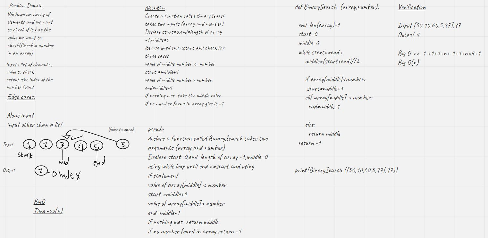

# Binary Search of Sorted Array
binary search is a method used to  search for a value inside an array to reduce the number time of iterations

## Whiteboard Process

## Approach & Efficiency
The Efficiency of Big O is O(n)
