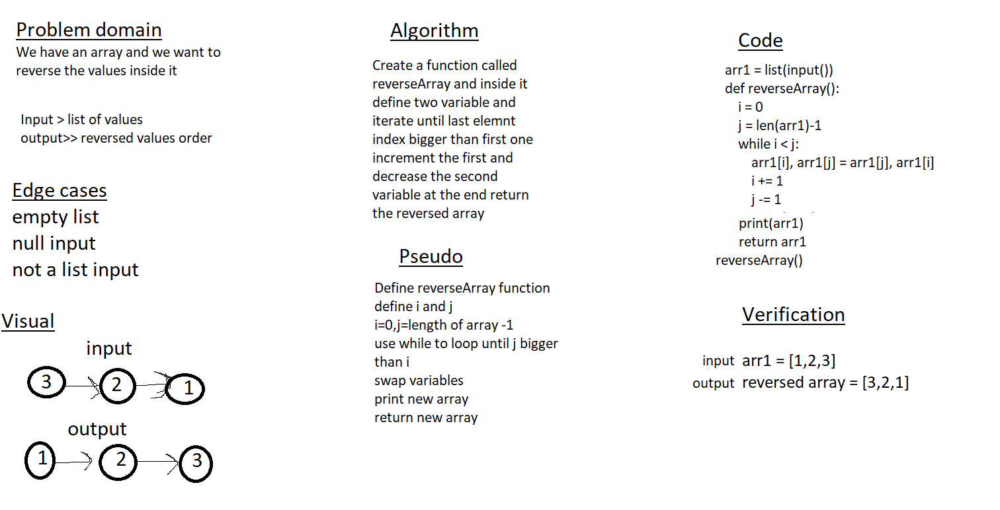

# Reverse an Array
 reversed array method changes the sequence of elements of the given array and returns the reverse sequence. In other words, the arrays last element becomes first and vice versa.

## Whiteboard Process

## Approach & Efficiency
<!-- What approach did you take? Discuss Why. What is the Big O space/time for this approach? -->
