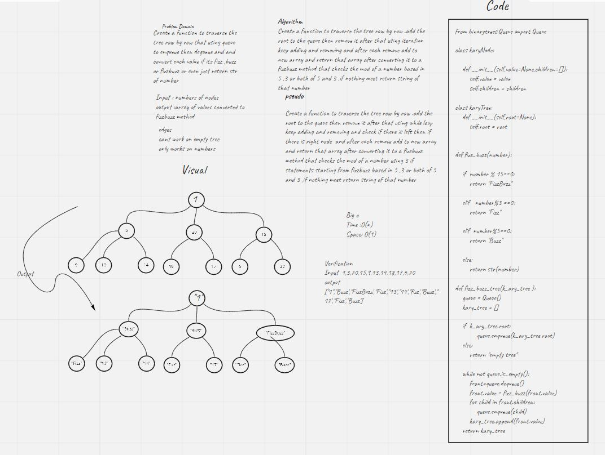
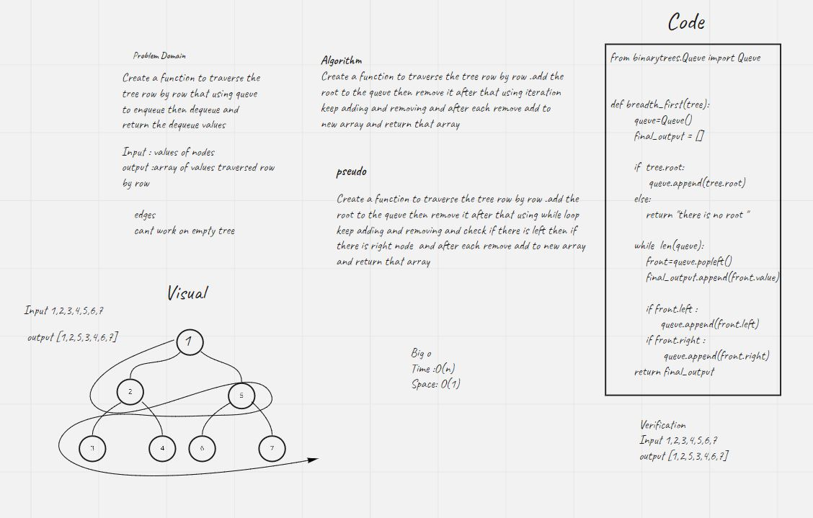
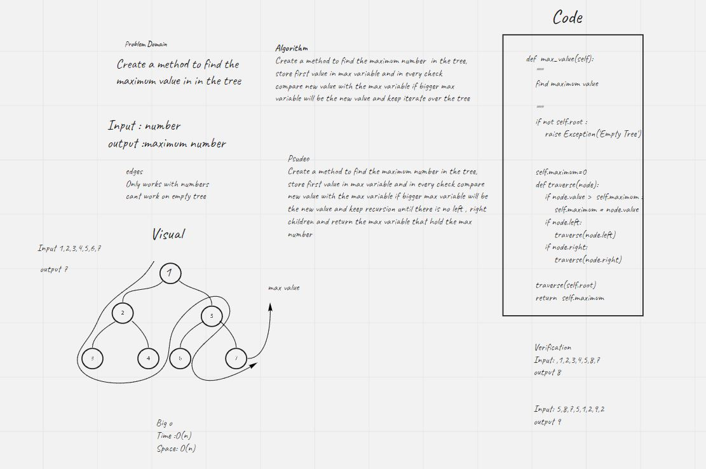

# Challenge Summary fizzbuzz
to traverse the tree row by row  using queue and then convert each number to a fizzbuzz values using fizzbuzz function

## Approach & Efficiency
Big o
Time : O(N)
Space: O(1)

## Solution
to traverse the tree row by row what even if its have more than 2 children  using queue and then convert each number to a fizzbuzz values using fizzbuzz function that check every number and convert it to a fizz,buzz,fizzbuzz or a string of number

# Challenge Summary Breadth
to traverse the tree row by row using queue
## Whiteboard Process

## Approach & Efficiency
Big o
Time : O(N)
Space: O(1)

## Solution
Create a function that traverse  the tree using queue and by removing each element and push it to a array

# Challenge Summary maximum number
Find the maximum value stored in the tree
## Whiteboard Process

## Approach & Efficiency
Big o
Time : O(N)
Space: O(N)

## Solution
Create a method that search for the maximum number and for each time save the bigger one inside max variable

# Trees
A tree data structure can be defined recursively as a collection of nodes, where each node is a data structure consisting of a value and a list of references to nodes. The start of the tree is the "root node" and the reference nodes are the "children". No reference is duplicated and none points to the root.

## Challenge
To BinaryTree  that has maximum 2 children and Traverse it using Depth First by preorder, inorder or postorder and to build binary sorted tree that has maximum 2 children to make the searching faster that has two methods (add)   A method that Adds a new node with that value in the correct location in the binary search tree. and (contains) A method that Returns: boolean indicating whether or not the value is in the tree at least once.

## Approach & Efficiency
### Binary  tree
#### Traverse
Time complexity:Big O(n)
Space complexity: Big o (n)

### Binary search tree
#### contains and add

Time complexity:BigO(Log N)
Space complexity: Big o (n)

## API
* pre order: traversing path   root >> left >> right
* in order:traversing path     left >> root >> right
* post order:traversing path   left >> right >> root

* Add
 Arguments: value
 Return: nothing
 Adds a new node with that value in the correct location in the binary search tree.

* Contains
 Argument: value
 Returns: boolean indicating whether or not the value is in the tree at least once.

## Structure and Testing
- [x] Can successfully instantiate an empty tree
- [x] Can successfully instantiate a tree with a single root node
- [x] Can successfully add a left child and right child to a  single root node
- [x] Can successfully return a collection from a preorder  traversal
- [x] Can successfully return a collection from an inorder  traversal
- [x] Can successfully return a collection from a postorder traversal
