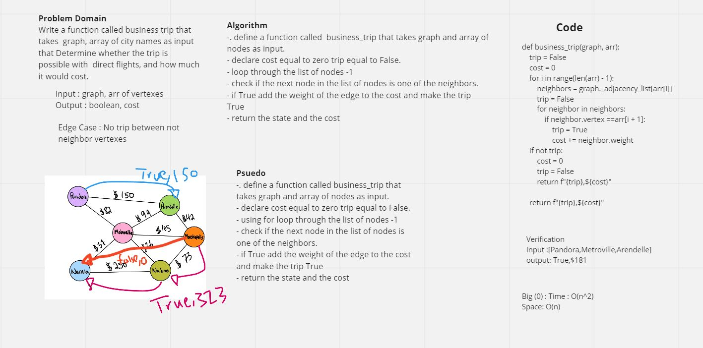

# Depth First Traversal

Depth-first search (DFS) is an algorithm for traversing or searching tree or graph data structures. The algorithm starts at the root node (selecting some arbitrary node as the root node in the case of a graph) and explores as far as possible along each branch before backtracking.
## Challenge

create a function that take a start node (node to search) and the output will be path in DFS logic it will be a list of node.

## Approach & Efficiency

The Efficiency of the Big O time is O(n^2)

The Efficiency of the Big O space is O(n)

## Solution

# Challenge Summary

Write a function called business trip that take arguments: graph, array of city names and  Determine whether the trip is possible with direct flights, and how much it would cost.

## Whiteboard Process

## Approach & Efficiency

The Efficiency of the Big O time is O(n^2)

The Efficiency of the Big O space is O(n)

## Solution

Write a function called business trip that determin the cost of anypath between nodes

    Arguments: graph, array of city names
    Return: cost or null

# Challenge Summary Graphs BFS

Breadth First Search (BFS) algorithm traverses a graph in a breadthward motion and uses a queue to remember to get the next vertex to start a search, when a dead end occurs in any iteration.

## Whiteboard Process

## Approach & Efficiency

The Efficiency of the Big O time is O(N^2)

The Efficiency of the Big O space is O(N)

## API and Solution

breadth first

Arguments: Node

Return: A collection of nodes in the order they were visited.

Display the collection

# Graphs

A Graph is a non-linear data structure consisting of nodes and edges. The nodes are sometimes also referred to as vertices and the edges are lines or arcs that connect any two nodes in the graph. ... A Graph consists of a finite set of vertices(or nodes) and set of Edges which connect a pair of nodes

## Challenge

Create a graph class in order to add nodes, add edges, get nodes, get neighbors, size.

## Approach & Efficiency

The Efficiency of the Big O time is O(N)

The Efficiency of the Big O space is O(N)

## API

### add node

    Arguments: value
    Returns: The added node
    Add a node to the graph

### add edge

    Arguments: 2 nodes to be connected by the edge, weight (optional)
    Returns: nothing
    Adds a new edge between two nodes in the graph
    If specified, assign a weight to the edge
    Both nodes should already be in the Graph

### get nodes

    Arguments: none
    Returns all of the nodes in the graph as a collection (set, list, or similar)

### get neighbors

    Arguments: node
    Returns a collection of edges connected to the given node
    Include the weight of the connection in the returned collection

### size

    Arguments: none
    Returns the total number of nodes in the graph

