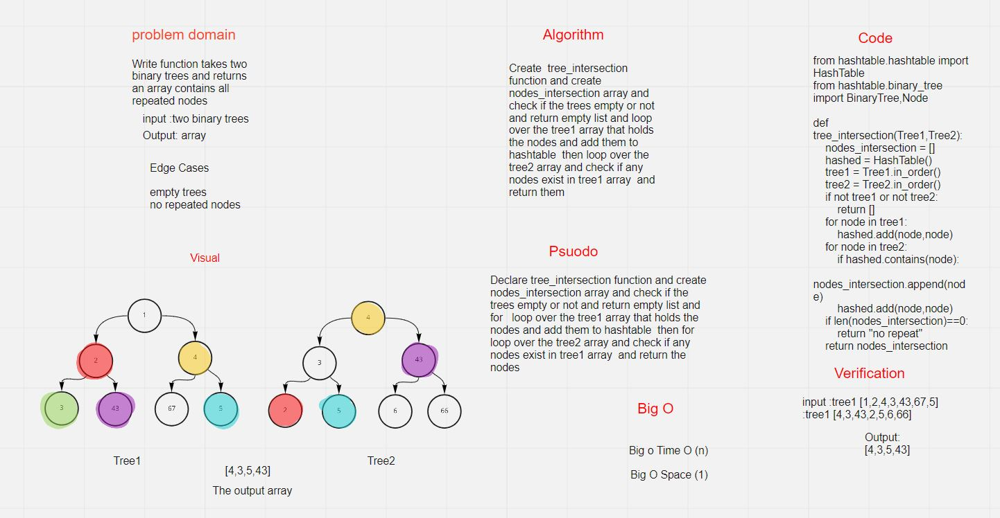
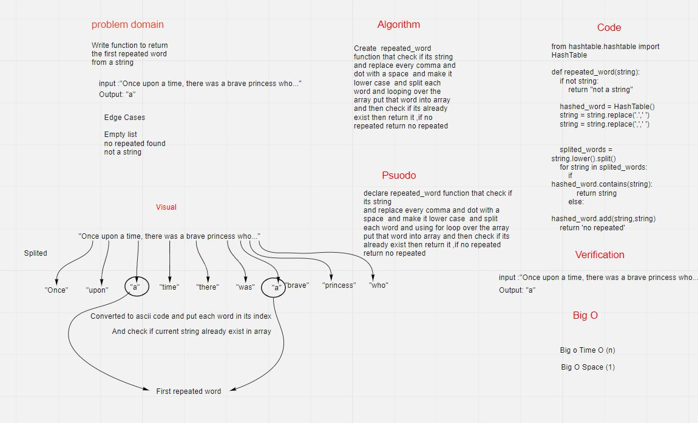

 # Challenge Summary

Write a function called tree_intersection that takes two binary trees as parameters adn return the repeated nodes.

## Whiteboard Process

## Approach & Efficiency

The Efficiency of the Big O time is O(n)

The Efficiency of the Big O space is O(n)

## Solution

Make function that take two trees and search for the nodes in the two trees and if any intersection between tree1 and tree2 nodes return them.

 # Challenge Summary
 a function called repeated word that finds the first word to occur more than once in a string

## Whiteboard Process

## Approach & Efficiency
The Efficiency of the Big O time is O(n)

The Efficiency of the Big O space is O(1)

## Solution
Create  repeated_word function that check if its string
and replace every comma and dot with a space  and make it lower case  and split each word and looping over the array put that word into array and then check if its already exist then return it ,if no repeated return no repeated

 # Hashtables
a hash table (hash map) is a data structure that implements an associative array abstract data type, a structure that can map keys to values. A hash table uses a hash function to compute an index, also called a hash code, into an array of buckets or slots, from which the desired value can be found.
## Challenge
Hashing is a way  used to uniquely identify a specific object from a group of similar objects and convert strings to ascii code and then put each value in its index and if collision happens use linked list to put multi nodes.

## Approach & Efficiency
The Efficiency of the Big O time is O(n)

The Efficiency of the Big O space is O(1)

## API

### hash
Arguments: key
Returns: Index in the collection for that key
### get
Arguments: key
Returns: Value associated with that key in the table
### add
Arguments: key, value
Returns: nothing
This method should hash the key, and add the key and value pair to the table, handling collisions as needed.
### contains
Arguments: key
Returns: Boolean, indicating if the key exists in the table already.
