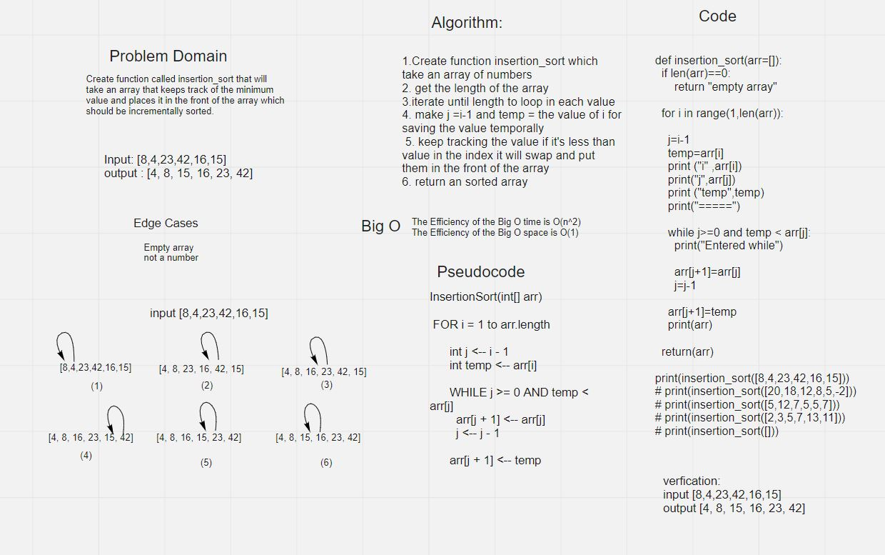

# Challenge Summary
Insertion Sort is a sorting algorithm that traverses and keeps track of the minimum value and places it in the front of the array which should be incrementally sorted.

## Whiteboard Process

## Approach & Efficiency
The Efficiency of the Big O time is O(n^2)
The Efficiency of the Big O space is O(1)

## Solution
It will take an array and keeps track of the minimum value and keep swapping between values until it will be incrementally sorted.

## Blog
[blog](blog.md)
