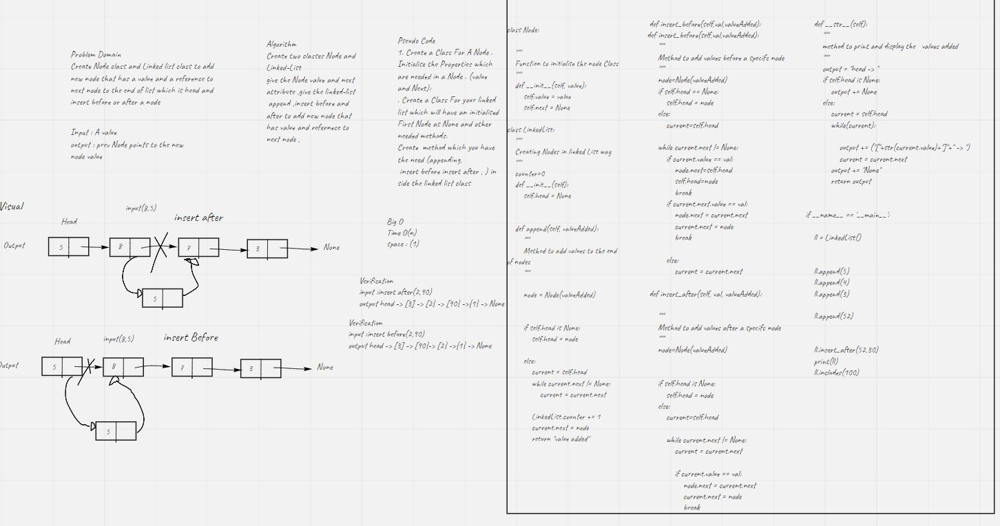
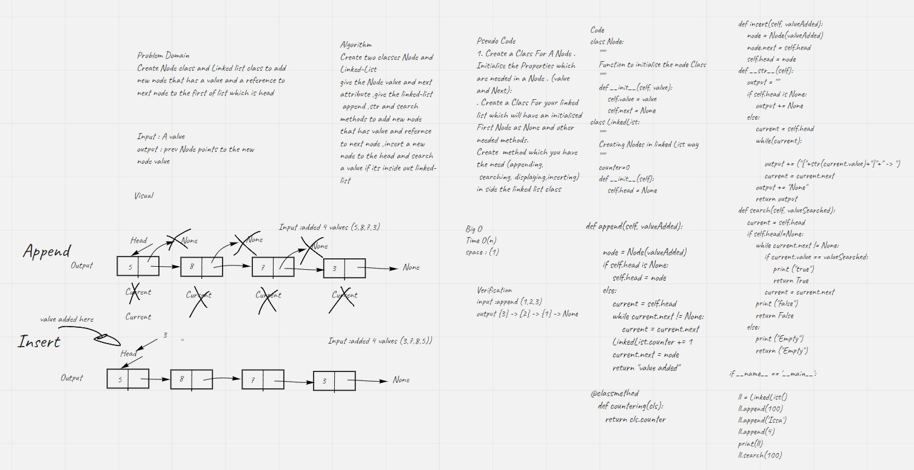

# code-challenge 6
# Singly Linked List

Create Node class and Linked list class to add new node at the end  and insert after or before a node

## Whiteboard Process

## Challenge
its a challenge to make Linked list and start adding nodes that has a value and points to the next node and last node points to None

## Approach & Efficiency
The Efficiency of Big O is O(n)

## API
We have 3 methods
1- append method : that used to add new node at the end  to the linked lists
2- insert before  method: that used to to add new node before a node
3- str method: to give a presenting way to the user when he prints the object after adding values for example
2- insert after  method: that used to to add new node after a node

## Task lists
- [x] Can successfully add a node to the end of the linked list

- [x] Can successfully add multiple nodes to the end of a linked list

- [x] Can successfully insert a node before a node located i the middle of a linked list
- [x] Can successfully insert a node before the first node of a linked list
- [x] Can successfully insert after a node in the middle of the linked list
- [x] Can successfully insert a node after the last node of the linked list

# code-challenge 5
# Singly Linked List

Create Node class and Linked list class to add new node that has a value and a reference to next node

## Whiteboard Process

## Challenge
its a challenge to make Linked list and start adding nodes that has a value and points to the next node and last node points to None

## Approach & Efficiency
The Efficiency of Big O is O(n)

## API
We have 3 methods
1- append method : that used to add new node to the linked lists
2- search method: that used to search for specific values in the linked list
3- str method: to give a presenting way to the user when he prints the object after adding values for example
4- counter method : to count how many times we added a value

## Task lists
- [x] Can successfully instantiate an empty linked list

- [x] Can properly insert into the linked list

- [x] The head property will properly point to the first
node in the linked list
- [x] Can properly insert multiple nodes into the linked list
- [x] Will return true when finding a value within the linked list that exists
- [x] Will return false when searching for a value in the linked list that does not exist
- [x] Can properly return a collection of all the values that exist in the linked list
