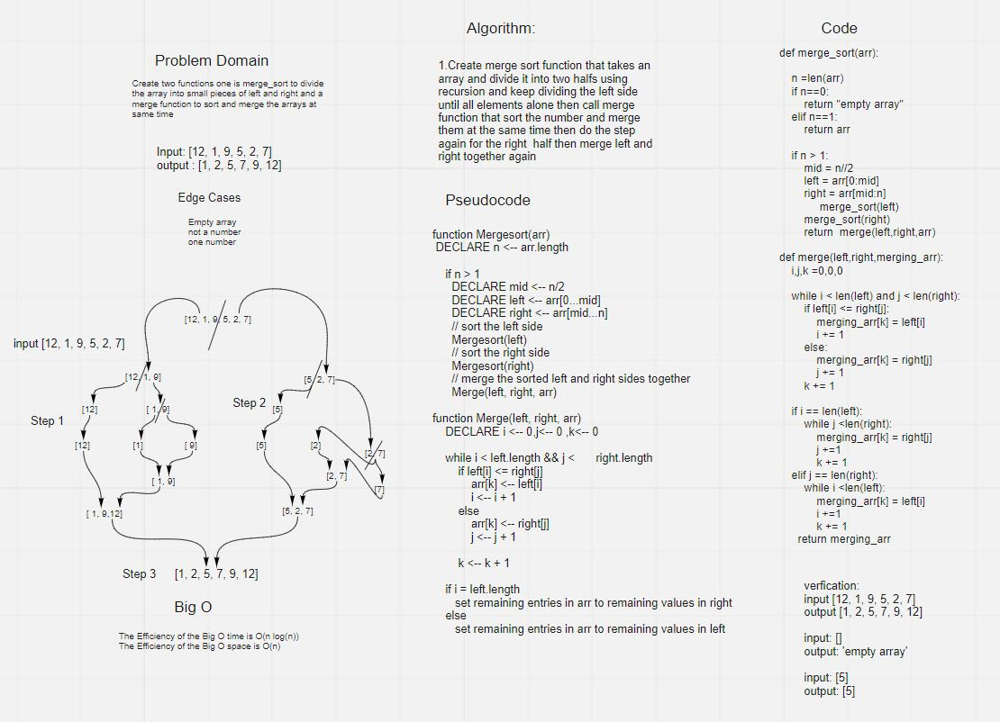

# Challenge Summary Merge Sort
Merge Sort is a Divide and Conquer algorithm. It divides the input array into two halves, calls itself for the two halves, and then merges the two sorted halves.

## Whiteboard Process

## Approach & Efficiency
The Efficiency of the Big O time is O(n log(n))
The Efficiency of the Big O space is O(n)

## Solution
 the array is recursively divided into two halves till the size becomes 1. Once the size becomes 1, the merge processes come into action and start merging arrays back till the complete array is merged.
