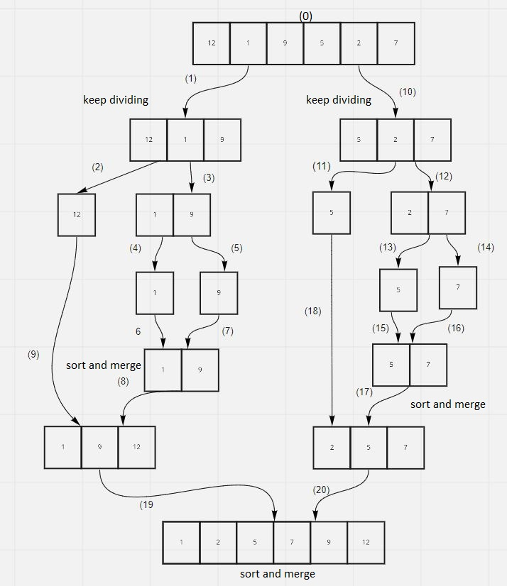

# Merge Sort
Merge Sort is a Divide and Conquer algorithm. It divides the input array into two halves, calls itself for the two halves, and then merges the two sorted halves.  the array is recursively divided into two halves till the size becomes 1. Once the size becomes 1, the merge processes come into action and start merging arrays back till the complete array is merged.

## Tracing

1. 1t divides the array into two halves. After that, it sorts the two arrays in a respective order .
2. It merges the two halves together and it easily becomes a complete single sorted array.
3.  Merge sort mechanism divides the  array first into two equal halves. Then it sorts the respective halves getting a sorted array at each end.
4.  Finally. the two halves are also equated whether the left index is greater than the right or vice versa and then the number is put into the array. In this way. the array is sorted.

