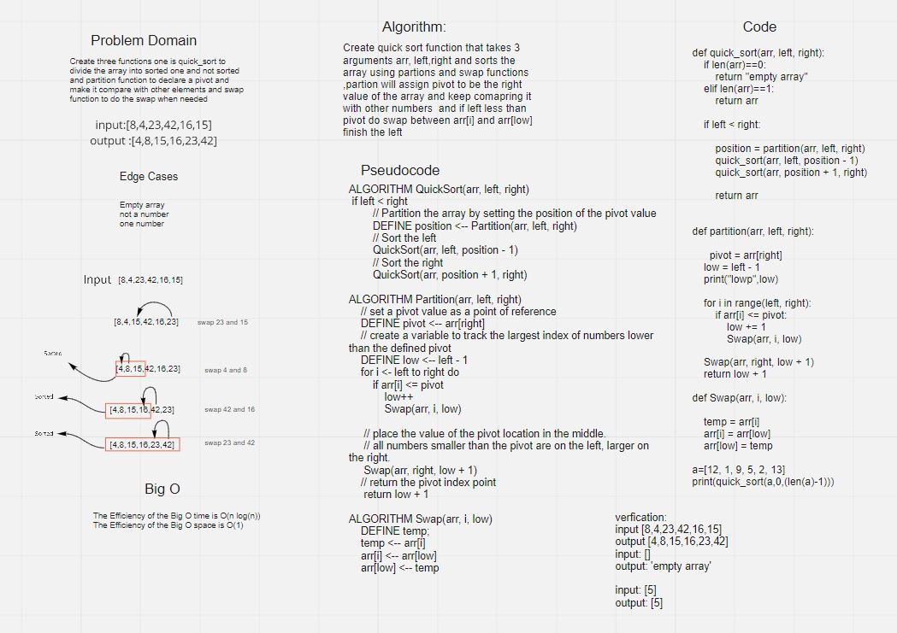

# Challenge Summary

QuickSort is a Divide and Conquer algorithm. It picks an element as pivot and partitions the given array around the picked pivot and keep comparing pivot and other elements and if the pivot bigger than element do swap.
## Whiteboard Process

## Approach & Efficiency

The Efficiency of the Big O time is O(nlogn)

The Efficiency of the Big O space is O(1)

## Solution

for the solution, you just need to insert any numeric array, and the quick_sort will check if left less than right and call partition function , Partition will assign pivot and compare it with other   numbers  and swap functions will sort the array,
