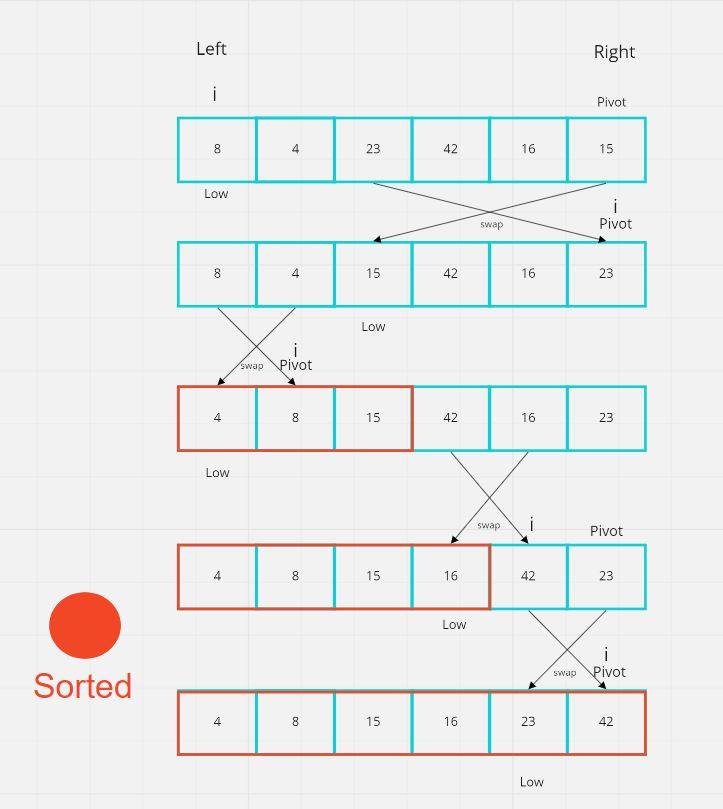

# Algorithm
Quicksort is a divide and conquer algorithm.

It divides the large array into smaller sub-arrays. And then quicksort recursively sort the sub-arrays.

### Pivot
1. Picks an element called the "pivot".

### Partition
2. Rearrange the array elements in such a way that the all values lesser than the pivot should come before the pivot and all the values greater than the pivot should come after it.

This method is called partitioning the array. At the end of the partition function, the pivot element will be placed at its sorted position.

### Recursive
3. Do the above process recursively to all the sub-arrays and sort the elements.

### Base Case
If the array has zero or one element, there is no need to call the partition method.

So we need to stop the recursive call when the array size is less than or equal to 1.

