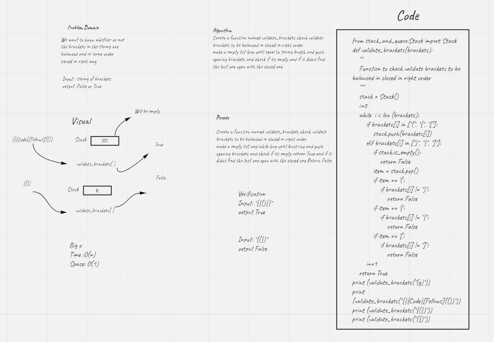
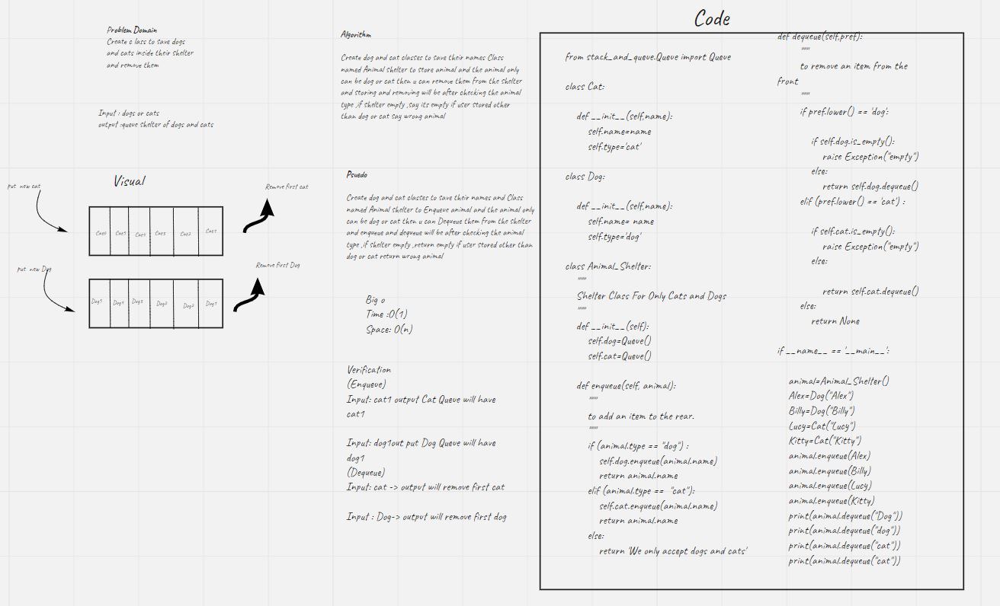

# Challenge Summary validate_brackets
Function to check validate brackets to be balanced in closed in right order


## Whiteboard Process


## Approach & Efficiency
check validate brackets to be balanced in closed in right order
Big O : O(n)
Space O(1)

## Solution

function validate
 Arguments: string
Return: boolean
representing whether or not the brackets in the string are balanced
```
Verification
Input: "{}(){}"
output True


Input: "{(})"
output False

```

# Challenge Summary stack-queue-Shelter
The challenge is to make new queue following FIFO by using two stacks for that

## Whiteboard Process


## Approach & Efficiency
To build two queues one for cats and one for dogs
Big O : O(1)
Space O(n)

## Solution

### enqueue(value)
## Enqueue or Dequeue depending on  animal type

```

Input	                  Args	          Output

[cat]->[cat]->[cat]      	cat1	      [cat]->[cat]->[cat]  ->[cat1]
Input	                              [dog]->[dog]->[dog]->[dog]
[dog]->[dog]->[dog]->[dog]

```
### dequeue()
```

Input	                  Args	          Output

[cat]->[cat]->[cat1]      	cat1      [cat]->[cat]
Input	                              [dog]->[dog]->[dog]->[dog]
[dog]->[dog]->[dog]->[dog]

```


# Challenge Summary stack-queue-pseudo
The challenge is to make new queue following FIFO by using two stacks for that

## Whiteboard Process


## Approach & Efficiency
To build new queue that FIFO using two stacks

Big O : O(n)
Space O(n)

## Solution

### enqueue(value)


keep transporting the values from stack 1 to stack 2 to get the top value and delete it then transport from stack2 to stack1 again
```

Input	         Args	   Output

[10]->[15]->[20]	5	[5]->[10]->[15]->[20]


```
### dequeue()
```

Input	               Output      Internal State
[5]->[10]->[15]->[20]	20	       [5]->[10]->[15])

```
# Stacks and Queues
Stack is a container of objects that are inserted and removed according to the last-in first-out (LIFO) principle. Queue is a container of objects (a linear collection) that are inserted and removed according to the first-in first-out (FIFO) principle.


## Challenge
### Stack
push onto a stack
push multiple values onto a stack
pop off the stack
empty a stack after multiple pops
peek the next item on the stack
instantiate an empty stack
Calling pop or peek on empty stack raises exception

### Queue
enqueue into a queue
enqueue into a queue
enqueue multiple values into a queue
dequeue out of a queue the expected value
peek into a queue, seeing the expected value
empty a queue after multiple dequeues
instantiate an empty queue
Calling dequeue or peek on empty queue raises exception

## Approach & Efficiency
To build a node stack and queue classes to perform many operations like insert remove and peek

Big O : O(1) for insert remove peek in stack and queue
Space O(n)

## API
### Stack
push : to add an item to the top of stack
pop :to remove an item from the top
peek : to know the top value


### Queue
Enqueue : to add an item to the rear
Dequeue :to remove an item from the front
peek : to know the front
